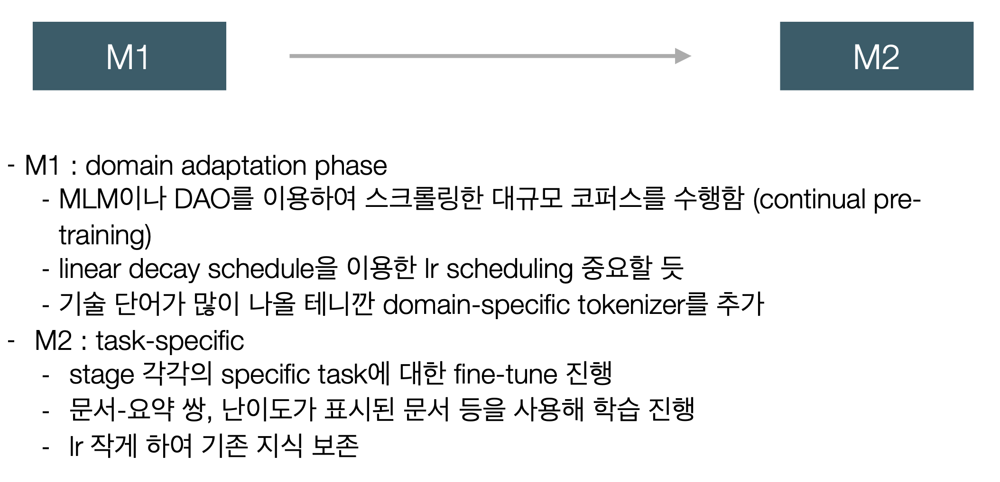

## Blueprint 2025.02.07. : SmartDevDigest

     Gyuyeon Lim (lky473736@icloud.com)
     https://lky473736.github.io/views/about.html

<br>

안녕하세요, 임규연입니다. 전반적으로 제가 생각 중인 아이디어 대해 적어보고자 문서 작성합니다. 6일 날 말씀드린 바와 같이 총 학습 과정 (pretrained model을 바탕으로 하는 fine-tuning)은 M1->M2 순서로 진행할 예정이며, 모델은 BART나 BERT (T5 계열)을 사용하는 것이 아닌 LLM 기반을 사용하려고 합니다. (llama 30B 정도의 모델, GPTQ 찾아보는 중) **아주 기초적으로 Pytorch를 이용해서 전반적인 프로토타입을 만들고 있습니다. 이는 다음 주에 설명과 함께 보여드리겠습니다.**

-------

### 학습 과정에 관한 간단한 설명

일단은 어제 말씀드린 거에 대하여 다시 한번 자세히 설명드리자면...


<br>

* **사실은 이 부분에 대해서 프론트엔드, 백엔드, 클라우드 파트에서 깊게 이해할 필요는 없습니다. 단지 모델 학습을 어떻게 할 것인가에 대한 설명입니다.**

<br>

크게 학습 프로세스를 두 과정으로 세분화시킬 것인데, **M1은 일종의 domain adaptation으로 백엔드단에서 가져온 컴퓨터공학에 관련된 문서를 학습시켜서 (or GPT를 통해서) 모델이 현재 저희가 수행하고자 하는 것에 대한 지식을 습득**하게 시킬 겁니다. 예시를 들자면, 의사도 처음부터 기초 의학을 그렇게 잘 알고 있지는 않았겠지요. 모델도 컴퓨터공학의 기본 지식을 습득해야 할 겁니다. 여기서 MLM (Masked Language Modeling) 방식을 사용해보려고 합니다. 

그리고 **M2는 실제 작업 수행 능력을 학습시키는 과정이라고 생각해주십시오.** 의사가 기초 의학 배운 후에 실제 진료 방법을 배우는 것처럼, 모델도 글을 요약하는 법과 난이도를 매기는 법을 배우게 하는게 필요할 겁니다. 또 다른 예시를 들자면, Docker 관련 긴 기술 문서가 있다고 했을 때 이에 대한 핵심 요약을 pair로 제공하여 학습시키는 겁니다. (긴 문서가 입력, 핵심 요약이 정답) 그래서 (실제 문서, 요약) 이렇게 pair 형태의 데이터셋을 만들어서 준비하여 학습시킬 예정입니다. 난이도를 label로도 두어야 하는데 (글을 보고 이 글의 난이도가 뭔지 예측하게 해야 하니깐) 이게 좀 많이 복잡합니다. 여러 측면을 고려해야 하는데요...

- 사용하는 전문 용어 수 (accerlation, optimization과 같은 어려운 용어)
- 개념의 복잡도 (Diffusion-based anomaly detection과 같은 어려운 개념)
- 필요한 배경지식 수준
- 코드가 포함되었다면? -> 알고리즘의 복잡도

이런 요소를 종합적으로 평가해서 1-5 스케일로 난이도를 일관되게 매기도록 할 겁니다. M2 단계에서는 LoRA를 사용하여 fine-tuning할 예정입니다. 

원래는 BART/T5와 BERT를 각각 따로 사용하여 요약과 난이도 평가를 수행하게 하려 했지만, 이를 한 LLM으로 묶어서 처리할 생각이 있습니다. 이 아이디어는 석준님이 조언해주셨습니다. LLM은 아직 hugging face를 뒤지고는 있지만, 아마도 Llama2-30B~32B 정도의 모델을 쓰는게 문맥이해나 zero-shot 성능이 좋을 것 같습니다. 더 찾아보고 명확하게 말씀드리려고 합니다. 

또한 GPTQ 4-bit quentimization을 이용하여 모델을 최적화할 예정입니다. 이도 석준님께서 아이디어를 주셨습니다. 이러면 모델 크기가 32비트 -> 4비트 양자화로 메모리효율성 측면에서 되게 좋아질 겁니다. (비용도 정상화 될거고요.) 그리고 확실히 전문 용어를 많이 다루는 컴퓨터공학의 특성 상 domain-specific tokenizer를 추가해서 진행해보려고 합니다. 이 tokenizer가 중요한 역할을 할 것 같은데요, orchestration, middleware같은 용어들을 잘 처리하기 위해서는 이것에 특화된 tokenizer가 필요합니다. 그리고 def, class, import와 같은 키워드들도 tokenizer가 인식할 수 있어야 하겠습니다.

그리고 평가 지표에 원래는 ROUGE나 BLEU와 같은 일종의 전통적인(?) metric을 활용해보려고 했으나, LLM 평가도 함께 추가하여 포괄적인 평가를 만들어보려고 합니다.

--------

### 간단하게 짜본 전체 구조와 테크, parameter, 입출력 json

기존에 LLM 프로젝트를 진행한 바가 있었어서 (https://github.com/lky473736?tab=repositories) 그때 짰던 것과 비슷하게 디렉토리 구조를 미리 구성해봤습니다.

```sh
smartdevdigest/
├── config/
│   └── config.yaml      # 일종의 설정 파일
├── src/
│   ├── __init__.py
│   ├── main.py          # 메인 실행 파일 
│   ├── model/          
│   │   ├── __init__.py
│   │   ├── analyzer.py  # 문서 분석기
│   │   └── utils.py     # 유틸리티 함수
│   ├── data/           
│   │   ├── __init__.py
│   │   ├── loader.py    # 데이터 로더
│   │   └── processor.py # 데이터 전처리 
│   └── utils/         
│       ├── __init__.py
│       └── logger.py    # 로깅 설정 (편하려고... 아마도 tqdm을 이용하지 않을까)
└── requirements.txt     # 의존성
```

config/config.yaml에서 넣을 파일들은 아래와 같이 고심 중입니다.

```sh
model:
  base_model: "찾아보는중 (모델)" 
  use_gptq: true
  device: "cuda"
  max_length: 2048 #아직모름 (미확정)

training:
  m1:  # M1 : Domain Adaptation 
    batch_size: 4
    learning_rate: 2e-5
    epochs: 3 # <--- 아직모름
    warmup_steps: 100
    gradient_accumulation: 4
    
  m2:  # M2 : Task-specific 
    batch_size: 2 # <-- 아직모름
    learning_rate: 1e-5 # <- lr 낮게, m1에서 배워놨던거 잊어먹으면 어떡함?
    epochs: 5
    warmup_steps: 50
    gradient_accumulation: 8

data:
  train_path: "data/train"
  valid_path: "data/valid"
  test_path: "data/test"
```

제가 사용할 테크들은 아래와 같습니다. 더 추가될 수는 있지만 아래는 반드시 사용합니다. tensorflow가 아닌 Pytorch를 사용하겠습니다. (requirements.txt에 첨부 예정)

```sh
torch>=1.9.0
transformers>=4.21.0
peft>=0.3.0
datasets>=2.6.1
scikit-learn>=0.24.2
rouge>=1.0.1
psutil>=5.8.0
gputil>=1.4.0
pyyaml>=5.4.1
numpy>=1.21.0
tqdm>=4.62.0
wandb>=0.12.0
```

제가 필요한 크롤링 정보는 다음과 같습니다. 백엔드 단에서 크롤링하실 때 아래와 같은 내용을 중점적으로 크롤링해주시면 좋겠어서 작성한 샘플입니다.

```json
{
    "source_type": "blog/paper/news",  // 블로그인가? 논문인가? 뉴스인가?
    "url": "https://www.URL.com",
    "language": "ko/en",              // 언어 (llm을 언어마다 최적화된걸로 사용할 수도 있는데, 일단은 얻으면 좋을 것 같습니다.)

    "title": "제목", // 없으면 None
    "content": "본문 내용", // 반드시 있어야 해요

    // metadata이기는 합니다. 없으면 안해도 돼요
    "author": "작성자", // 없으면 안해도 돼요
    "publish_date": "발행일", // 이건 있으면 좋을 것 같아요
    "tags": ["AI", "Web", ...], // 있으면 좋을 것 같아요
    "views": 1000  // 없으면 안해도 돼요 (논문같은 경우엔 인용수)
}
```

AI단에서 내뱉을 json 파일은 아래와 같습니다.

```json
{
    "summary": "생성된 요약문",
    "keywords": ["핵심", "키워드", "리스트"],
    "difficulty_level": {
        "score": 3.5,
        "label": "intermediate"
    },
    "prerequisites": ["필요한", "선수", "지식"],
    "technical_terms": [
        {
            "term": "용어",
            "explanation": "설명"
        }
    ],
    "processing_time": 2.5
}
```

프로토타입을 짜서 보여드리면 명확히 이해가 되실 것 같으니, 다음에 기능명세서를 쓰는 회의 전까지 얼른 코딩해보겠습니다. 